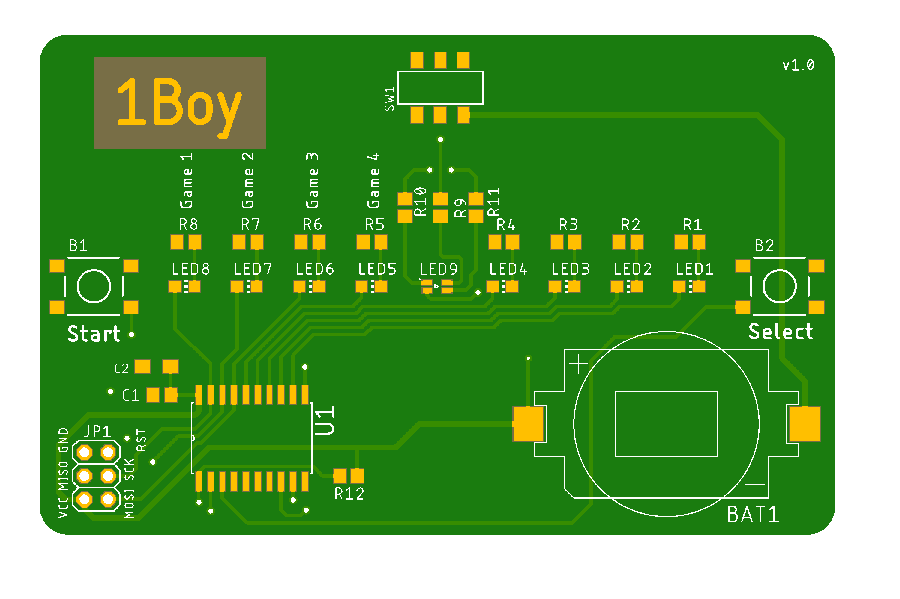

# 1Boy

Project made mainly for fun, but also for microcontroller project on university.
## Hardware
Credit card-sized 'console' based on ATtiny2313 with 1-dimensional screen, two buttons and power switch. 4 leds on the left and on the right are just green, while the middle one is RGB.
Powered by single CR2032 battery.

## Games
**Lowest cost console on market, up to four fun games!**
*Due to lack of memory, currently two games can be played:*

- Pong (1P/2P) - bounce the ball between you and other player or play a duel between your left and right hand
- Memory (1P) - repeat the lengthening sequence of lights

Planned games (after optimalisation of first two):

- Cowboys (2P) - be the fastest hand in the west and press the button faster than the other player after the countdown
- Space shooter (1P) - defeat aliens by pressing buttons in set pattern for each rgb colour

board files created in Cadsoft Eagle
